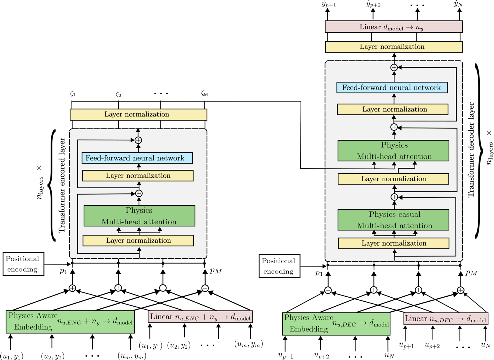

# A Physics-Informed In-Context Learning Framework for Online Force Prediction in Contact Tasks

This repo includes initial Python codes of a purely data-driven transformer for online prediction of interaction forces, to be augmented with Physics-informed layers to improve generalisation in Out-of-distribution (OOD) scenarios. The proposed approach extends transformer-based meta learning with physically grounded inductive biases, where students are encouraged to look for and implement one or more modifications to the transformer architecture so it can outperform its data-driven counterpart in OOD scenarios. Those modifications can include, but are not limited to:
  - **Physics-based loss function**,
  - **Physics-aware embedding**,
  - **Physics-focused attention mechanisms**,
  - **Learnable physics parameters**

An example of the resulting architecture is shown in the attached figure, where inputs/outputs of the system are divided as follows:

**Inputs**:

  - **Cartesian Positions**: (x, y, z),
  - **Cartesian Velocities**: (ẋ, ẏ, ż),
  - **Cartesian Accelerations**: (ẍ, ÿ, z̈),
  - **Cartesian Target positions**: (xₜ, yₜ, zₜ),
  - **Cartesian Target velocities**: (ẋₜ, ẏₜ, żₜ)

**Outputs**:

  - **Interaction Forces**: (Fₓ, Fᵧ, F_z)

